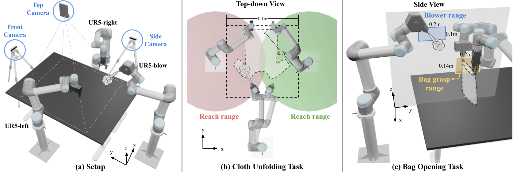

# DextAIRity: Deformable Manipulation Can be a Breeze

[Zhenjia Xu](http://www.zhenjiaxu.com/)<sup>1</sup>,
[Cheng Chi](https://cheng-chi.github.io/)<sup>1</sup>,
[Benjamin Burchfiel](http://www.benburchfiel.com/)<sup>2</sup>,
[Eric Cousineau](https://www.eacousineau.com/)<sup>2</sup>,
[Siyuan Feng](https://www.cs.cmu.edu/~sfeng/)<sup>2</sup>,
[Shuran Song](https://www.cs.columbia.edu/~shurans/)<sup>1</sup>
<br>
<sup>1</sup>Columbia University, <sup>2</sup>Toyota Research Institute
<br>
RSS 2022

### [Project Page](https://dextairity.cs.columbia.edu/) | [Video](https://youtu.be/_B0TpAa5tVo) | [arXiv](https://arxiv.org/abs/2203.01197)

This repository contains code for training and evaluating DextAIRity in both simulation and real-world settings on a three-UR5 robot arm setup for Ubuntu 18.04.

## Table of Contents
- 1 [Simulation](#simulation)
  - 1.1 [Simulation setup](#simulation-setup)
  - 1.2 [Python Dependencies](#python-dependencies)
  - 1.3 [Compiling the simulator](#compiling-the-simulator)
  - 1.4 [Evaluate on cloth unfolding in simulation](#evaluate-on-cloth-unfolding-in-simulation)
  - 1.5 [Train on cloth unfolding in simulation](#train-on-cloth-unfolding-in-simulation)
- 2 [Real World](#real-world)
  - 2.1 [Real world setup](#real-world-setup)
  - 2.2 [Evaluate on cloth unfolding in the real world](#evaluate-on-cloth-unfolding-in-the-real-world)
  - 2.3 [Train on bag opening in the real world](#train-on-bag-opening-in-the-real-world)
  - 2.4 [Evaluate on bag opening in the real world](#evaluate-on-bag-opening-in-the-real-world)

## Simulation
### Simulation setup
This section walks you through setting up the CUDA accelerated cloth simulation environment. To start, install [conda](https://docs.conda.io/en/latest/), [docker](https://docs.conda.io/) and [nvidia-docker](https://github.com/NVIDIA/nvidia-docker).

#### Python Dependencies
We have prepared a conda YAML file which contains all the python dependencies.
```
conda env create -f environment.yml
```

#### Compiling the simulator
This codebases uses a CUDA accelerated cloth simulator which can load any arbitrary mesh to train a cloth unfolding policy. The simulator is a fork of [PyFlex](https://github.com/YunzhuLi/PyFleX) from [FlingBot](https://github.com/columbia-ai-robotics/flingbot), and requires a NVIDIA GPU to run. We have provided a Dockerfile in this repo for compiling and using this simulation environment for training.
```sh
docker build -t dextairity .
```
To launch the docker container, go to this repo's root directory, then run
```sh
export DEXTAIRITY_PATH=${PWD}
nvidia-docker run \
	-v $DEXTAIRITY_PATH:/workspace/DextAIRity \
	-v /path/to/your/anaconda3:/path/to/your/anaconda3 \
	--gpus all --shm-size=64gb  -d -e DISPLAY=$DISPLAY -e QT_X11_NO_MITSHM=1 -it dextairity --name DextAIRity
```
You might need to change `--shm-size` appropriately for your system.

Add conda to PATH, then activate DextAIRity
```sh
export PATH=/path/to/your/anaconda3/bin:$PATH
. activate DextAIRity
``` 
Then, at the root of this repo inside the docker container, compile the simulator with
```sh
. ./prepare.sh
. ./compile.sh
```
The compilation will result in a `.so` shared object file. `./prepare.sh` sets the environment variables needed for compilation and also tells the python interpreter to look into the build directory containing the compiled `.so` file. 

Finally, you should be able to run the testing code outside of docker.
```sh
. ./prepare.sh
python test_sim.py
```
If you can see a cloth inside the GUI, it means the simulatior is set correctly. Otherwise, you can check out [FlingBot's repository](https://github.com/columbia-ai-robotics/flingbot), [Softgym's Docker guide](https://github.com/Xingyu-Lin/softgym/blob/master/docker/docker.md), and [Daniel Seita](https://danieltakeshi.github.io/)'s [blog post](https://danieltakeshi.github.io/2021/02/20/softgym/) on installing PyFlex with Docker for more information.

### Evaluate on cloth unfolding in simulation
In the repo's root, download and unzip pretrained models and task configurations。
```sh
wget dextairity.cs.columbia.edu/download/pretrained_models.zip
wget dextairity.cs.columbia.edu/download/data.zip
unzip pretrained_models.zip
unzip data.zip
```
As discribed in the paper, our model is evaluated on four tasks.
- **Large Rect / X-Large Rect** contain rectangular cloths with at least one side larger than the reach range. Edge lengths are uniformly sampled from 0.4m to 0.75m for Large, 0.8m to 0.95m for X-Large.
- **Shirts / Dresses** contain a subset of shirt and dress meshes from the CLOTH3D dataset.

Configurations of each task are stored in the `data` folder.

To evaluate DextAIRity on one of the evaluation tasks, run the following command:
```sh
python test_cloth_unfolding.py \
  --grasp_checkpoint pretrained_models/DextAIRity_grasp.pth \
  --blow_checkpoint pretrained_models/DextAIRity_blow.pth \
  --task TASK
```
Please repalce `TASK` with one of the following takss: `Test_Large_Rect`, `Test_XLarge_Rect`, `Test_Shirt`, `Test_Dress`. Evaluation result and visualization will be stored in the `exp` folder.

### Train on cloth unfolding in simulation
Note that the performance of grasping policy and blowing policy are highly coupled – grasping score is dependent on the following blowing steps, and blowing performance is affected by how the cloth is grasped. This coupling can make training unstable. To solve this issue, we designed simple heuristic policies for grasping and blowing to allow independent pre-training for each module before combining them for further fine-tuning. The heuristic blowing policy is to place the blower in the middle of the workspace facing forward. Because this heuristic policy can unfold the cloth somewhat, it provides a reasonable starting place from which to bootstrap training. The heuristic grasping policy uniformly samples 100 grasping position pairs on the cloth and selects the pair with the largest distance.

```sh
# grasping policy pre-training
python train_cloth_unfolding.py \
  --policy DextAIRity_fixed

# blowing policy pre-training
python train_cloth_unfolding.py \
  --policy DextAIRity_random_grasp

# Fine-tuning
python train_cloth_unfolding.py \
  --policy DextAIRity \
  --grasp_checkpoint DextAIRity_fixed \
  --blow_checkpoint DextAIRity_random_grasp
```

## Real World
### Real world setup
Our real world system uses 3 UR5 arms, one equipped with an OnRobot RG2 gripper, one with a Schunk WSG50, and one with an air pump. We modify the Schunk WSG50 finger tip with a rubber tip for better cloth pinch grasping. We use 2 RGB-D cameras, an Azure Kinect v3 for the top down camera and an Intel Realsense D415 as front camera in the cloth unfolding task or side camera in the bag opening task.

- Calibrate ur5 arms and the table via `real_world/calibration_robot.py` and `calibration_table.py`.
- Setup cloth size and bag size in `real_world/cloth_env.py` and `real_world/bag_env.py`.
- (Cloth unfolding) Setup stretching primitive variables in `real_world/cloth_env.py`. Please check out check out [FlingBot's repository](https://github.com/columbia-ai-robotics/flingbot) for more details.
- (Bag opening) Setup cropping size and color filter parameters in `real_world/bag_env.py`.

### Evaluate on cloth unfolding in the real world
Prepare checkpoints first. You can either download the prtrained models or training from scratch in simulation. Then, run the following evaluation command:
```sh
python test_cloth_unfolding_real.py \
  --grasp_checkpoint pretrained_models/DextAIRity_grasp.pth \
  --blow_checkpoint pretrained_models/DextAIRity_blow.pth
```
### Train on bag opening in the real world
First, collect data in real world using a random policy.
```sh
python collect_bag_data.py 
```
Then train a classification model on this dataset.
```sh
python train_bag_opening.py
```

### Evaluate on bag opening in the real world
To evaluate the model in the real world:
```sh
python test_bag_opening.py
```

## BibTeX
```
@inproceedings{xu2022dextairity,
	title={DextAIRity: Deformable Manipulation Can be a Breeze},
	author={Xu, Zhenjia and Chi, Cheng and Burchfiel, Benjamin and Cousineau, Eric and Feng, Siyuan and Song, Shuran},
	booktitle={Proceedings of Robotics: Science and Systems (RSS)},
	year={2022}
}
```

## License

This repository is released under the MIT license. See [LICENSE](LICENSE) for additional details.

## Acknowledgement

- The codebase is built on top of [FlingBot](https://github.com/columbia-robovision/flingbot).
- The code for [DeepLab-V3-Plus](model/deeplab.py) is modified from [pytorch-deeplab-xception](https://github.com/jfzhang95/pytorch-deeplab-xception).
